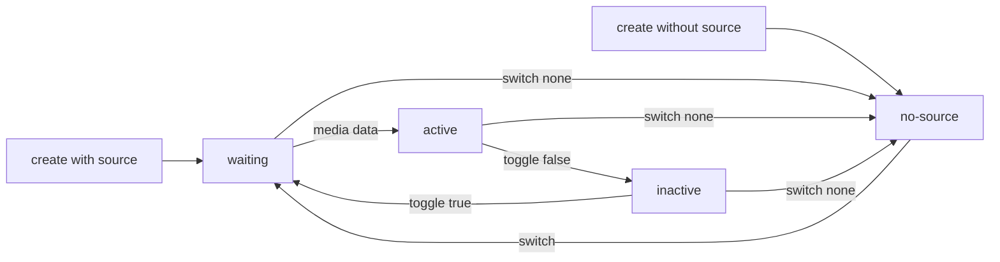
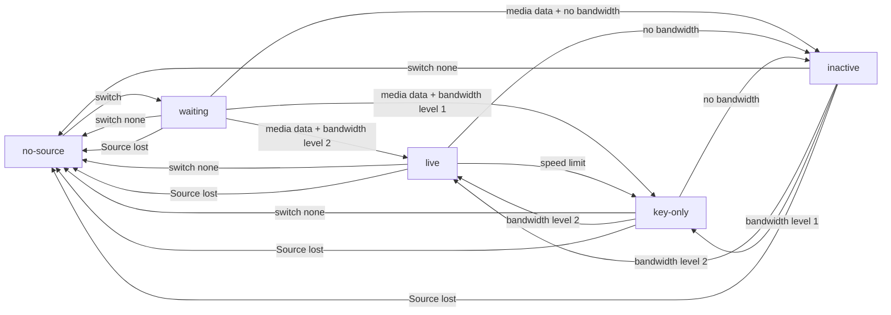

- Feature Name: media-webrtc-sdk
- Start Date: 2024-02-02
- RFC PR: [8xff/rfcs#0005](https://github.com/8xff/rfcs/pull/0005)

# 1. Summary

[summary]: #summary

This RFC provides an overview of how the WebRTC client connects to atm0s-media-server and its functionality.

# 2. Motivation

[motivation]: #motivation

To enhance the user experience, we aim to develop a client SDK that is platform-agnostic and highly customizable. This SDK should provide a seamless integration with atm0s-media-server network topology and align with our approach to handle media streams. Our primary focus is to ensure that the SDK is user-friendly and easily adaptable to various use cases.

# 3. User Benefit

User can use WebRTC to connect to the media server and create complex media stream topologies.

# 4. Design Proposal

To ensure simplicity, we propose a SDK protocol that exclusively uses HTTP (not WebSocket) and WebRTC.

- HTTP is used only for sending RPC requests to the cluster, typically during the Connect and Retry phases.
- WebRTC is utilized for sending and receiving media streams, as well as RPC and event communication after establishing a connection.
- Each client will have sender tracks and receiver tracks to handle media streams. Senders are responsible for sending media streams to the server, while receivers are used to receive media streams from the server. Both senders and receivers can be paused, resumed, or switched to another source. There are two types of senders: audio and video, and two types of receivers: audio and video. Each sender and receiver is assigned a unique ID by the client, such as 'audio_1', 'audio_2', 'video_1', 'video_2', and it does not need to be unique with other clients.

We have some terms:

- **_Sender_**: A sender is a track that sends media to the server. It can be an audio or video track.
- **_Receiver_**: A receiver is a track that receives media from the server. It can be an audio or video track.
- **_Source_**: A source that the receiver is pinned to. It can be a audio or video. Source is identify by a pair peer_id and track_id.
- **_Peer_**: A peer is a client that is connected to the server.
- **_Room_**: A room is a group of peers that are connected to the same server.
- **_Conn_**: A connection is a WebRTC connection between the client and the server.
- **_Feature_**: A feature is a set of advance functionalities that the client can use. For example, mix-minus, chat, ...

## 4.1 HTTP Request/Response format

**Request and Response Format**

All requests and responses will be encoded in Protobuf format. In case of have error, server will response with below content:

```protobuf
message Error {
    uint32 code = 1;
    string message = 2;
}
```

In folder 0005-media-webrtc-sdk includes all protobuf schemas:

- [shared.proto](./0005-media-webrtc-sdk/shared.proto): all data types
- [gateway.proto](./0005-media-webrtc-sdk/gateway.proto): for interact with gateway node
- [conn.proto](./0005-media-webrtc-sdk/conn.proto): for interact with media-server over datachannel
- [features.proto](./0005-media-webrtc-sdk/features.proto): for feature extension

## 4.2 Connect Establishment

Before connecting to the server, the client needs to prepare the following:

- Enable WebRTC connection with data channel.
- Create a list of senders and receivers.
- Generate WebRTC OfferSDP.

Once the client is ready, it can send a connect request to the server.

**_Endpoint_**: `POST GATEWAY/webrtc/connect`

**_Headers_**: `Authorization: Bear {token}`

**_Body_**:

```proto
message ConnectRequest {
    string version = 2;
    optional shared.RoomJoin join = 3;
    features.Features features = 4;
    shared.Tracks tracks = 5;
    string sdp = 6;
}
```

In there:

```protobuf

```

**_Response Data:_**

```
message ConnectResponse {
    string conn_id = 1;
    string sdp = 2;
}
```

The explanation of each request parameter:

- token: authorization token for connectivity only, it isn't room token.
- version: is the version of the client SDK.
- join: the information for joining to room, if not provide, it will connect in non-joined state and client must to call .join after have this information

- features: a JSON object containing some features that the client wants to use. For example: mix-minus, spatial room, etc.
- tracks: list of senders and receivers, which include state of it for fast initializing
- sdp: the OfferSDP that the client created.

The explanation of each response parameter:

- sdp: is the AnswerSDP which server created, it should contain all ice-candidates from server.
- conn_id: global identifier of WebRTC connection. This is used by control api like restart-ice, ice-trickle, kick, etc.

Error list:

| Code   | Error                 | Description             |
| ------ | --------------------- | ----------------------- |
| TODO   | INVALID_TOKEN         | The token is invalid.   |
| 0x2000 | INVALID_SDP           | The sdp is invalid.     |
| TODO   | INVALID_REQUEST       | The request is invalid. |
| 0x2001 | INTERNAL_SERVER_ERROR | The server is error.    |
| TODO   | GATEWAY_ERROR         | The gateway is error.   |

After that, the client needs to wait for the connected event from the WebRTC connection and the connected event from the data channel.
If the client doesn't receive any event after a period of time, it will set the restart ice flag and retry connecting to the server with the newest offer SDP.
After several attempts (configurable), the client will stop retrying and report an error to the user as CONNECTION_TIMEOUT.

## 4.3 Restart-ice

**_Endpoint_**: POST `GATEWAY/webrtc/:conn_id/restart-ice`

**_Headers_**: `Authorization: Bear {token}`

**_Body_**: same with connect request but the tracks should sending with current state

**_Response Data_**: same with connect response

By doing this, in case of a network change, the client can retry connecting to the server with the newest offer SDP. If the server is still alive, it will respond with a new answer SDP. However, if the server is dead, the gateway will retry connecting to another server. The session state can be restored using the track state and each feature state.

## 4.4 Ice-tricle

Each time the client's WebRTC connection has a new ice-candidate, it should be sent to the gateway using the following endpoint:

**_Endpoint_**: POST `GATEWAY/webrtc/conns/:conn_id/ice-candidate`

**_Body_**:

```
{
    candidate: String
}
```

**_Response Data_**: None

Error list:

| Code | Error                 | Description             |
| ---- | --------------------- | ----------------------- |
|      | INVALID_CONN          | The conn_id is invalid. |
|      | INVALID_ICE           | The ice is invalid.     |
|      | INVALID_REQUEST       | The request is invalid. |
|      | INTERNAL_SERVER_ERROR | The server is error.    |
|      | GATEWAY_ERROR         | The gateway is error.   |

## 4.5 Datachannel Request/Response format

The format for encoding all requests and responses sent over the data channel is Protobuf. The structure of the request and response objects is as follows:

```proto
Request {
    uint32 req_id = 1;
    oneof request {
        Session session = 2;
        Sender sender = 3;
        Receiver receiver = 4;
    }
}

message ClientEvent {
    uint32 seq = 1;
    oneof event {
        Request request = 2;
    }
}
```

```proto
message Response {
    uint32 req_id = 1;
    oneof response {
        shared.Error error = 2;
        Session session = 3;
        Sender sender = 4;
        Receiver receiver = 5;
    }
}

message ServerEvent {
    uint32 seq = 1;
    oneof event {
        Session session = 2;
        Room room = 3;
        Sender sender = 4;
        Receiver receiver = 5;
        Response response = 6;
    }
}
```

The seq is an incremental value generated on the sender side. It helps us to detect data loss. The req_id is used to map between requests and responses and also

## 4.6 In-session requests

At the current state, we already have one WebRTC connection to the server, so there is no need to send any requests over HTTP. All requests will be sent over the WebRTC datachannel.

Typically, the client will need to perform various actions with the media server, such as:

- Creating/Releasing senders
- Creating/Releasing receivers
- Sender actions: pause, resume, switch stream
- Receiver actions: pause, resume, switch remote source, update priority, and layers

All actions that involve changing tracks will be performed locally first, and then the `update_sdp` command will be sent to the server.

### 4.6.1 Session requests, events

```
message Request {
    message Session {
        message RoomJoin {
            shared.RoomJoin info = 1;
            string token = 2;
        }

        message RoomLeave {

        }

        message UpdateSdp {
            shared.Tracks tracks = 1;
            string sdp = 2;
        }

        message Disconnect {

        }

        oneof request {
            RoomJoin join = 1;
            RoomLeave leave = 2;
            UpdateSdp sdp = 3;
            Disconnect disconnect = 4;
        }
    }
}
```

```
message Response {
    message Session {
        message RoomJoin {

        }

        message RoomLeave {

        }

        message UpdateSdp {
            string sdp = 1;
        }

        message Disconnect {

        }

        oneof response {
            RoomJoin join = 1;
            RoomLeave leave = 2;
            UpdateSdp sdp = 3;
            Disconnect disconnect = 4;
        }
    }
}
```

```
message ServerEvent {
    message Session {
        message Connected {

        }

        message JoinedRoom {
            string room = 1;
            string peer = 2;
        }

        message LeavedRoom {
            string room = 1;
            string peer = 2;
        }

        message Disconnected {
            string reason =  1;
        }

        oneof event {
            Connected connected = 1;
            JoinedRoom joined = 2;
            LeavedRoom leaved = 3;
            Disconnected disconnected = 4;
        }
    }
}
```

#### 4.6.1.1 Update SDP action

Each time we make changes to the WebRTC connection or negotiationneeded event fired, we need to send an `update_sdp` request to the server over the data channel. The update sdp request must to include tracks state.

#### 4.6.1.2 Room join/leave action

Client can dynamic join to other room with Join/Leave request. This is useful when we don't have information about room at connecting state, just connect and join after have. This feature also useful will video conference application, where user can join to other child rooms without recreate connection.

When user successful joined or leaved a room, server also send event JoinedRoom or LeavedRoom to client.

#### 4.6.1.3 GoAway event

Goaway event is sent by the server in some cases:

- The server is going to shutdown or restart.
- The client lifetime is expired, this is useful in some video conference application where each client only has limited session time; example 1 hour.
- The client is kicked by the server.

`remain_seconds` represents the remaining time that the client will be served by the server. In the event that a client needs to reconnect, it should do so before the remain_seconds expire to avoid interrupting the client session.

In case of "shutdown", the client should reconnect by sending restart-ice request.

### 4.6.2 Room requests, events

We can subscribe to peers event (joined, left, track added, track removed) and also can unsubscribe from it.

```
message Request {
    message Rooom {
        message SubscribePeer {
            string peer = 1;
        }

        message UnsubscribePeer {
            string peer = 1;
        }

        oneof request {
            SubscribePeer subscribe;
            UnsubscribePeer unsubscribe;
        }
    }
}
```

```
message Response {
    message Rooom {
        message SubscribePeer {

        }

        message UnsubscribePeer {

        }

        oneof response {
            SubscribePeer subscribe;
            UnsubscribePeer unsubscribe;
        }
    }
}
```

```
message ServerEvent {
    message Room {
        message PeerJoined {
            string peer = 1;
            optional string metadata = 2;
        }

        message PeerUpdated {
            string peer = 1;
            optional string metadata = 2;
        }

        message PeerLeaved {
            string peer = 1;
        }

        message TrackStarted {
            string peer = 1;
            string track = 2;
            shared.Kind kind = 3;
            optional string metadata = 4;
        }

        message TrackUpdated {
            string peer = 1;
            string track = 2;
            shared.Kind kind = 3;
            optional string metadata = 4;
        }

        message TrackStopped {
            string peer = 1;
            string track = 2;
            shared.Kind kind = 3;
        }

        oneof event {
            PeerJoined peer_joined = 1;
            PeerUpdated peer_updated = 2;
            PeerLeaved peer_leaved = 3;
            TrackStarted track_started = 4;
            TrackUpdated track_updated = 5;
            TrackStopped track_stopped = 6;
        }
    }
}
```

#### 4.6.2.1 Action: Subscribe/Unsubscribe to other peers event

(Note that this action only works with `subscribe.tracks` is false.)

This feature for allowing client free to select what peer it interested in, it is useful in spatial-chat application like `Gather.town`. By subscribe, server will send peer's tracks event like: started, stopped or updated.

#### 4.6.2.3 Event: Peer joined / updated / leaved

If client connect with `subscribe.peers` is true, server will send event about joined and leaved event of each peers which joined with `publish.peer` is true.

#### 4.6.2.3 Event: Track started / updated / stopped

If client connect with `subscribe.tracks` is true or client subscribed to the peer, server will send event about peer's track started or stopped event of each peers which joined with `publish.tracks` is true.

### 4.6.3 Sender, actions, events

For creating a sender, we need to create a transceiver with kind as audio or video. After that, we need to create a track and add it to the transceiver. Then we need to send an `update_sdp` request to the server.

```
message Request {
    message Sender {
        message Attach {
            shared.Sender.Source source = 1;
            shared.Sender.Config config = 2;
        }

        message Detach {

        }

        string name = 1;
        oneof request {
            Attach attach = 2;
            Detach detach = 3;
            shared.Sender.Config config = 4;
        }
    }
}
```

```
message Response {
    message Sender {
        message Attach {

        }

        message Detach {

        }

        message Config {

        }

        oneof response {
            Attach attach = 1;
            Detach detach = 2;
            Config config = 3;
        }
    }
}
```

```
message ServerEvent {
    message Sender {
        message State {
            enum StateType {
                WAITING = 0;
                NO_SOURCE = 1;
                ACTIVE = 2;
                INACTIVE = 3;
            }

            StateType state = 1;
        }

        string name = 1;
        oneof event {
            State state = 2;
        }
    }
}
```

#### 4.6.3.1 Attach or detach sender source action

This action is used when the user changes the source, for example, when the user changes the camera or microphone. This can also be used when the user stops sharing the camera, in which case we will release the local stream and send a switch without the source param.

If source is none, this sender will be removed from the room, and the receiver that is pinned to this sender will receive an updated event with the source not set. The room also sends a TrackStopped event to all subscribed peers.

#### 4.6.3.2 State updated event

This event is sent by the server when the state of the sender is changed. This is useful when the client implements loading animation when the user changes the source, or when the user mutes/unmutes the sender.

Sender states is explained below:

- Waiting: The sender is pinned but server dont received any media data.
- No-source: The sender is not pinned to any source.
- Active: The sender is active, and server is receiving media data.
- Inactive: The sender is pinned but .



### 4.6.4 Receiver create/release, actions

To create a receiver, we need to create a transceiver with kind as audio or video. After that, we need to create a track and add it to the transceiver. Then we need to send an `update_sdp` request to the server.

```
message Request {
    message Receiver {
        message Attach {
            shared.Receiver.Source source = 1;
            shared.Receiver.Config config = 2;
        }

        message Detach {

        }

        string name = 1;
        oneof request {
            Attach attach = 2;
            Detach detach = 3;
            shared.Receiver.Config config = 4;
        }
    }
}
```

```
message Response {
    message Receiver {
        message Attach {

        }

        message Detach {

        }

        message Config {

        }

        oneof response {
            Attach attach = 1;
            Detach detach = 2;
            Config config = 3;
        }
    }
}
```

```
message ServerEvent {
    message Receiver {
        message State {
            enum StateType {
                NO_SOURCE = 0;
                WAITING = 1;
                LIVE = 2;
                INACTIVE = 3;
            }

            StateType state = 1;
        }

        message Stats {
            message Source {
                uint32 bitrate_kbps = 1;
                float rtt = 2;
                float lost = 3;
                float jitter = 4;
            }

            message Transmit {
                uint32 spatial = 1;
                uint32 temporal = 2;
                uint32 bitrate_kbps = 3;
            }

            optional Source source = 1;
            optional Transmit transmit = 2;
        }

        string name = 1;
        oneof event {
            State state = 2;
            Stats stats = 3;
        }
    }
}
```

### 4.6.4.1 Attach or detach receiver source action

If source is none, the receiver will be paused.

### 4.6.4.2 Config action

We can provide new config when UI changed for updating priority and limit of quality for better bitrate usage.

### 4.6.5.3 State updated event

Receiver states is explained below:

- `no_source`: The receiver is created but not pinned to any source.
- `waiting`: The receiver is pinned but does not received media data.
- `live`: The receiver is live.
- `key_only`: The receiver is live but only receives key frames, which may be for speed limiting purposes.
- `inactive`: The receiver is pinned but does not have enough bandwidth to receive.



### 4.6.5.3 Receiver stats event

Stats information can be used for show current issues for viewer, which can provide more useful about source of the issues.

## 4.7 Features

### 4.7.1 Feature: mix-minus mixer

The mix-minus feature has two modes:

- Manual: In this mode, the client can manually add or remove sources to the mixer.
- Auto: In this mode, the media server will automatically add or remove all audio sources except the local source to the mixer.

```
message Request {
    message Attach {
        repeated Source sources = 1;
    }

    message Detach {
        repeated Source sources = 1;
    }

    oneof request {
        Attach attach = 1;
        Detach detach = 2;
    }
}
```

```
message Response {
    message Attach {

    }

    message Detach {

    }

    oneof response {
        Attach attach = 1;
        Detach detach = 2;
    }
}
```

```
message ServerEvent {
    message MappingSlotSet {
        uint32 slot = 1;
        Source source = 2;
    }

    message MappingSlotDel {
        uint32 slot = 1;
    }

    message SlotAudioLevel {
        uint32 slot = 1;
        int32 audio_level = 2;
    }

    message MappingSlotsAudioLevel {
        repeated SlotAudioLevel slots = 1;
    }

    oneof event {
        MappingSlotSet slot_set = 1;
        MappingSlotDel slot_del = 2;
        MappingSlotsAudioLevel slots_audio_level = 3;
    }
}
```

#### 4.7.1.1 Connect request

In connect request, we add field to features params:

```
message Source {
    string peer = 1;
    string track = 2;
}

message Config {
    Mode mode = 1;
    repeated Source sources = 2;
}
```

#### 4.7.1.2 Action: Add/remove source to mixer

Note that, this action only work with `manual` mode.

#### 4.7.1.3 State update event

We have 2 types of event, slot bind changed and slot audio level.

# 5. Drawbacks

[drawbacks]: #drawbacks

No drawbacks.

# 6. Rationale and alternatives

[rationale-and-alternatives]: #rationale-and-alternatives

We have some alternatives:

- Whip/Whep: but it not flexible and cannot be used to create complex media stream topology.
- Livekit protocol: the protocol is designed for Livekit server topology.

# 7. Unresolved questions

[unresolved-questions]: #unresolved-questions

Not yet.

# 8. Future possibilities

[future-possibilities]: #future-possibilities

We can have some improvements:

- Dynamic event subscription.
- Binary event and request/response format.
